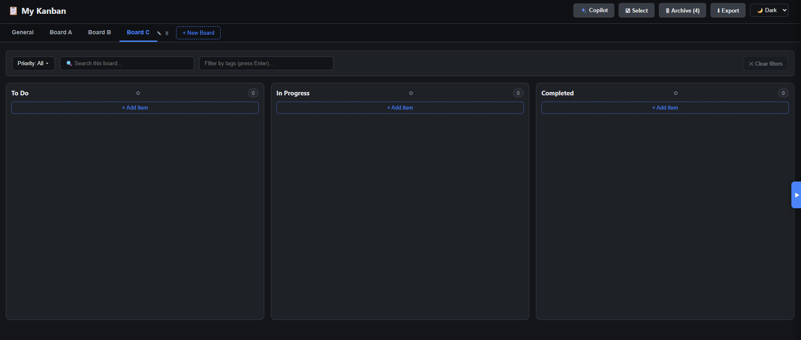
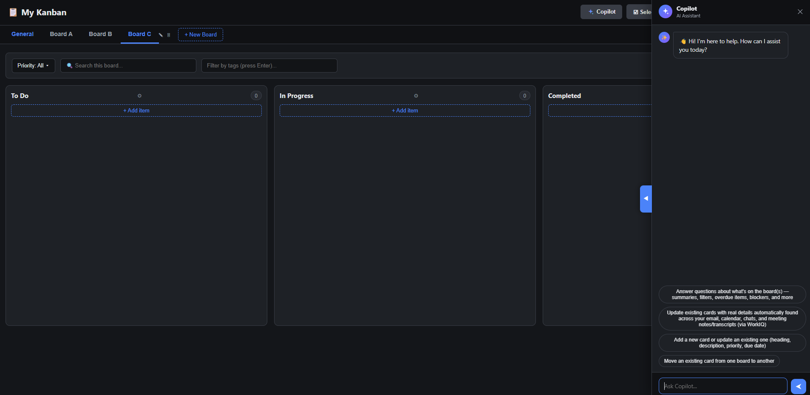

# My Kanban

A local, single-user Kanban dashboard that runs entirely on your own machine. It's a
static HTML/CSS/JS front-end backed by a tiny zero-dependency Node.js server, with all
data stored in a plain JSON file on disk — no database, no cloud account, no external
services required to use the board itself.

It also has an optional built-in **Copilot chat widget** that lets you create, update,
move, and query cards using natural language, and — if you have the GitHub Copilot CLI
with the WorkIQ plugin installed — automatically refresh cards with real information
found in your email, calendar, Teams chats, and meeting notes/transcripts.



## Contents

- [Prerequisites](#prerequisites)
- [Getting the code](#getting-the-code)
- [Starting and stopping the app](#starting-and-stopping-the-app)
- [Opening it in your browser](#opening-it-in-your-browser)
- [Using the dashboard](#using-the-dashboard)
  - [Select mode & exporting to Excel](#select-mode--exporting-to-excel)
  - [Importing from Excel](#importing-from-excel)
- [Using the Copilot chat widget](#using-the-copilot-chat-widget)
- [Data storage](#data-storage)
- [Project structure](#project-structure)

## Prerequisites

| Requirement | Why | Notes |
|---|---|---|
| **Node.js** (LTS, v18+) | Runs the local server (`src\server.js`) | No `npm install` needed — the app has zero external dependencies. Download from [nodejs.org](https://nodejs.org/) if you don't have it. |
| **Windows** | `Start Kanban.vbs` / `Stop Kanban.vbs` are VBScript launchers | You can still run the server manually with `node src\server.js` on any OS. |
| **A modern browser** | Chrome, Edge, or Firefox | The UI uses standard HTML5 drag-and-drop, `contenteditable`, and `fetch` — no browser plugins needed. |
| **GitHub Copilot CLI** *(optional)* | Powers the in-app Copilot chat widget | Only needed if you want to use the chat panel. Without it, the board still works fully — you just won't have the chat assistant. |
| **WorkIQ plugin for Copilot CLI** *(optional)* | Lets the chat widget refresh cards from your email/calendar/Teams/meeting notes | Only needed for the "update/refresh card(s) from WorkIQ" feature. Install via `/plugin` inside the Copilot CLI if you want this. |

## Getting the code

Clone the repository to your machine:

```powershell
git clone <your-repository-url> my-kanban
cd my-kanban
```

There is no build step and no `npm install` — the server (`src\server.js`) only uses
Node's built-in modules (`http`, `fs`, `path`, `child_process`).

## Starting and stopping the app

**Easiest way — double-click the provided scripts:**

- **`Start Kanban.vbs`** — starts the server in the background (no console window) and
  opens your default browser to `http://localhost:9000` automatically.
- **`Stop Kanban.vbs`** — finds whatever process is listening on port 9000 and stops it,
  freeing the port so you can start it again later.

**Manual way (any OS, or if you prefer a visible console):**

```powershell
node src\server.js
```

You should see:

```
Kanban dashboard running at http://localhost:9000
```

Press `Ctrl+C` in that terminal to stop it, or run `Stop Kanban.vbs` if it was started
hidden.

> By default the server listens on port `9000`. Set the `PORT` environment variable
> before starting it if you need a different port, e.g. `set PORT=9100 && node src\server.js`.

## Opening it in your browser

Once the server is running, open:

```
http://localhost:9000
```

If you used `Start Kanban.vbs`, this happens automatically. If the server was already
running, `Start Kanban.vbs` will still open the browser tab for you.

## Using the dashboard

### Boards (tabs)

Across the top of the page are board tabs — by default **General**, plus any boards
you've added (e.g. **Board A**, **Board B**, **Board C**, ...).

- Click **`+ New Board`** to add a new tab — give it a name and it appears immediately.
- Hover a tab to reveal a small rename (✎) and delete (🗑) icon.
- Deleting a board shows a 6‑second **Undo** toast in case of a mis-click.
- Drag a card and drop it directly onto a tab to move it to that board (same column).

### Columns

Every board has three fixed columns: **To Do**, **In Progress**, and **Completed**.
Each column shows a live item count and an optional **WIP limit** (set via the gear ⚙
icon next to the column title) that highlights the column when exceeded.

### Creating an item

Click **`+ Add item`** at the bottom of a column:

- Type a heading and click the confirm check for a quick, heading-only card, **or**
- Click **"…or open full editor"** to fill in everything at once:
  - **Heading** — required, short title.
  - **Outcome** — a one-time, static statement of what "done" looks like for this item.
    Set once and generally left unchanged afterwards.
  - **Priority** — Low (green), Medium (yellow), or High (orange) — click a swatch.
  - **Due Date** and **Tags** — set together on one compact row. Tags are colored
    (4 colors: blue, green, yellow, red) and searchable/filterable.
  - **Description** — a rich-text box with a toolbar (Bold/Italic/Underline, headings,
    bullet/numbered lists, font color, highlight color, and font size by point number,
    like Word). Use it for status notes, next actions, blockers, dates, and contacts.
  - **Checklist** — add sub-tasks with checkboxes via **"+ Add Task"**.

Click **Save**. To edit an existing card, just click it — the same dialog opens
pre-filled. A **Delete** button appears in edit mode.

### Moving cards

- **Drag and drop** a card between columns, or onto a different board's tab.
- Hover a card to reveal a small **⇄** (move to another board) and 🗑 (archive) icon.
- Moving a card into **Completed** automatically stamps today's date as its completion
  date; moving it back out clears that date. An overdue card (past its Due Date and not
  in Completed) shows a **⚠ Overdue** badge.

### Searching and filtering

Each board has its own **search box** (matches heading/description, tolerant of minor
typos/casing), a **Priority** filter dropdown, and a **tag filter** (type a tag name and
press Enter to filter by it). Click **"Clear filters"** to reset.

### Archive

Deleting a card moves it to the board's **Archive** (shown as a count next to the
**Archive** button in the header) rather than deleting it outright — open the Archive
panel to view or permanently remove archived items.

### Select mode & exporting to Excel

Click **Select** in the header to enter multi-select mode on cards, or use the
**Export** button directly:

- Choose to export the **currently selected board**, pick specific boards via
  checkboxes, or export **all boards** at once.
- Each exported board becomes its own sheet in a single `.xlsx` workbook, with columns
  for Heading, Outcome, Priority, Due Date, Completion Date, Overdue, Tags, and every
  description section (Current status, Next action, Blockers, Dates, Contacts, Update
  History).

### Importing from Excel

Click **⬆ Import** in the header and pick an `.xlsx` file — normally one produced by
the **Export** feature above (including one that's since been opened, edited, and
re-saved in Excel):

- Each worksheet in the file becomes a board. If a board with the same name already
  exists, its items are merged into that board instead of creating a duplicate
  (items already present, matched by heading, are skipped so re-importing the same
  file twice won't create duplicates); otherwise a new board is created.
- Columns are matched by header name rather than position, so older exports missing a
  newer column (or newer exports with extra columns) still import cleanly.
- After a successful import, boards reload automatically and an **Undo** toast lets you
  reverse it — removing newly created boards or just the items that were merged in.
- If the file has no recognizable Kanban sheet (i.e. no "Heading" column), the import
  is rejected with an error instead of creating empty/garbage boards.

### Theme

The **Dark/Light** dropdown in the top-right switches the whole UI's color theme; your
choice is remembered (stored in the browser's `localStorage`) between visits.

## Using the Copilot chat widget

Click **Copilot** in the top-right to open the chat panel.



The widget is scoped strictly to this Kanban app — it won't answer general coding or
knowledge questions, only requests that map to one of the capabilities below (each
backed by a skill documented in `skills\`).

> **About WorkIQ:** the "refresh from WorkIQ" capability shells out to the GitHub
> Copilot CLI in the background. If the CLI or its WorkIQ plugin isn't installed, the
> chat will tell you so and point you at `/plugin` inside the Copilot CLI to install it
> — everything else (create/update/move/query) works without WorkIQ.

### Sample prompts by capability

**Create or update a card** (`kanban-item` skill)
- "Add a high priority card to the Board A board to follow up on the loan renewal."
- "Create a new card on Board B: set up a meeting with the architecture team on 4th August, low priority."
- "Change the priority of the 'Renew office lease' card to high."
- "Add a due date of next Friday to the XYZ card."
- "Add a tag 'urgent' to the loan renewal card."

**Move a card between boards** (`move-item` skill)
- "Move the loan renewal card from Board A to Board B."
- "Move 'Set up architecture meeting' from General to Board C."

**Ask about the board(s)** (`board-query` skill)
- "Summarize the Board A board."
- "Show me all high priority items."
- "What's overdue right now?"
- "What are the blockers for Board B?"
- "What items should I focus on this week?"
- "What's the status of the XYZ card?"

**Refresh card(s) from WorkIQ** (`item-update` skill — requires the WorkIQ plugin)
- "Update setup meeting with Board B item."
- "Refresh the XYZ card."
- "Update all items on the Board A board."
- "Refresh all items on the Board C board."
- "Refresh all items across all boards."
- "Update all items."

You never need to tell it *where* to search (email vs. calendar vs. Teams, etc.) — it
always searches everything automatically, and it will only change a card if it
genuinely finds new, real information; it never invents or guesses content, and it
never overwrites a card's **Outcome**.

## Data storage

All board data lives in a single JSON file:

```
data\kanban-data.json
```

The server reads/writes this file on every request via a simple `GET /api/data` /
`POST /api/data` API with optimistic-concurrency protection (a `_rev` counter — if two
writers race, the losing write gets a `409 Conflict` instead of silently overwriting
the other). This file is created automatically the first time you run the app if it
doesn't already exist. Back it up like any other file if you want to keep a history —
it's plain, human-readable JSON.

## Project structure

```
my-kanban/
├─ Start Kanban.vbs      # double-click to start the server + open the browser
├─ Stop Kanban.vbs       # double-click to stop the server
├─ data/
│  └─ kanban-data.json   # all board/item data (created automatically)
├─ image/                # screenshots used in this README
├─ skills/                # Copilot CLI skill docs describing each chat capability
│  ├─ kanban-item/
│  ├─ move-item/
│  ├─ board-query/
│  └─ item-update/
└─ src/
   ├─ server.js          # Node HTTP server: static files, /api/data, /api/copilot-chat, export/import
   ├─ app.js              # front-end app logic (rendering, drag-drop, dialogs, chat widget)
   ├─ index.html          # page markup
   ├─ style.css           # styling (dark/light themes included)
   └─ xlsxWriter.js       # minimal, dependency-free .xlsx file writer used by Export
```
